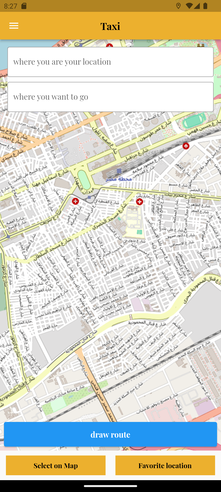
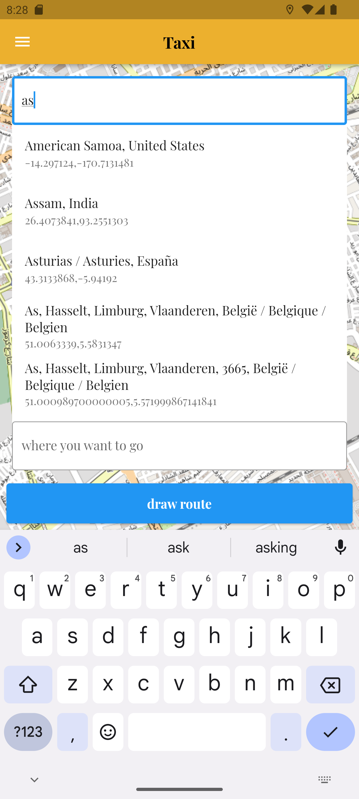
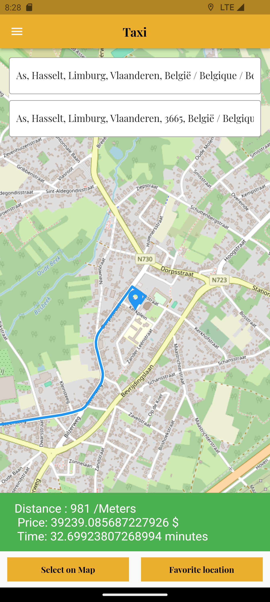

<!--
This README describes the package. If you publish this package to pub.dev,
this README's contents appear on the landing page for your package.

For information about how to write a good package README, see the guide for
[writing package pages](https://dart.dev/guides/libraries/writing-package-pages).

For general information about developing packages, see the Dart guide for
[creating packages](https://dart.dev/guides/libraries/create-library-packages)
and the Flutter guide for
[developing packages and plugins](https://flutter.dev/developing-packages).
-->

A flutter place search from two different location ,  location picker , make route between two points and measure distance(meters) between two point plugin that uses Open Street Map. we can abled to measure time and price of tour between two point on map . it is completely free and easy to use.

## Features

Search location by places
Easy to use
make route between two points
measure distance(meters) between two point
change location
measure price of tour between two point on map
measure time of tour between two point on map

## Demo






## Getting started

import 'flutter_map_search_pick_price_time_distance_route_sherifammar/flutter_map_search_pick_price_time_distance_route_sherifammar.dart';

## Usage

you are required:
 token from openrouteservice web site
 price of meter
 speed for meter

 

```
  FlutterMapSearchPickPriceRoute(
                latidedCurrent: 29,// require latitude
                orsApiKey: 'your token from openrouteservice web site',
                longtideCurrent: 92,// require longitude
                pricepermeter: 5,// your price of meter
                timepermeter: 10,// time will take for one meter
              ),


